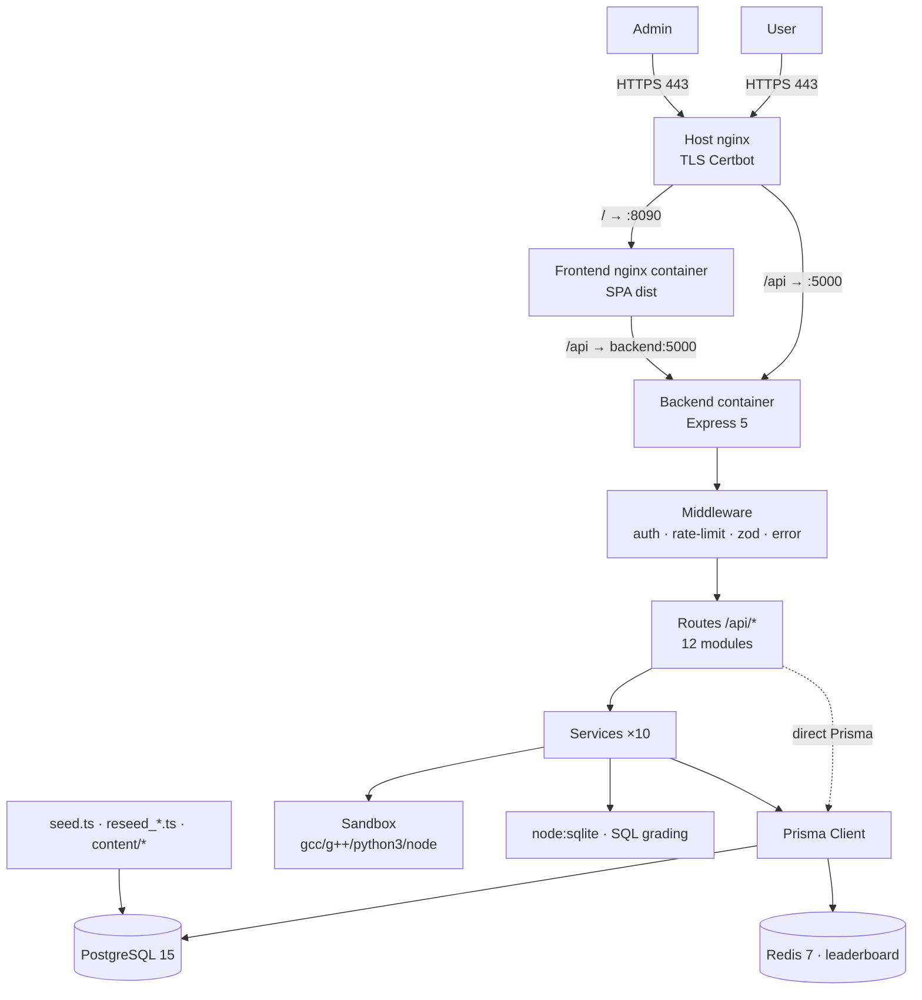
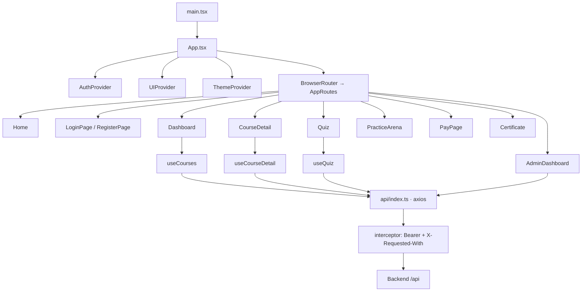
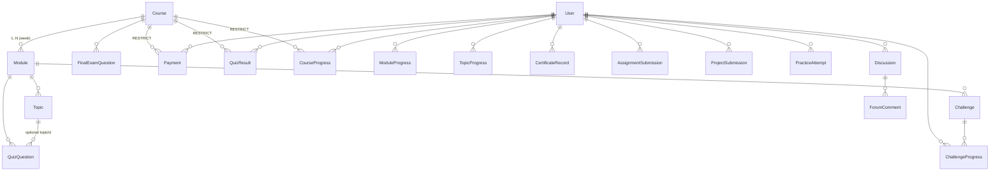
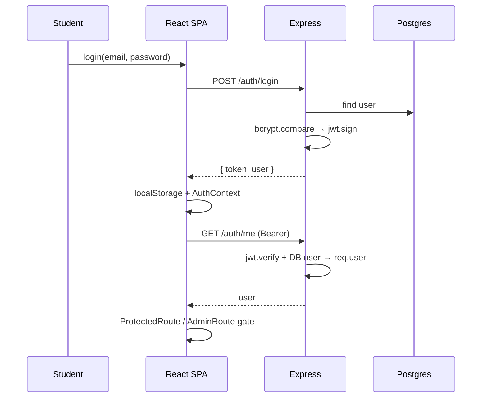
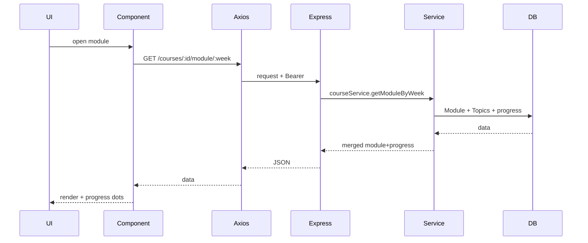

# EduNexus Pro — Current Architecture & System Understanding Report

> **Document type:** Baseline — analysis + documentation only. No code was modified.
> **Date:** 2026-08-12
> **Source:** Direct inspection of `/home/abhi/repo/edunexuspro` (backend, frontend, prisma, docker, nginx, workflows, deploy scripts) plus the repo's own specs (`docs/superpowers/specs/*.md`), `GEMINI.md`, `DEPLOY.md`, `walkthrough.md`.
> **Status labels:** ✅ Confirmed from code · 🔶 Inferred from code · ⚪ Unknown / not confirmed

---

## 1. Project Overview

**EduNexus Pro** is a paid, India-focused ed-tech platform (live at `https://edunexus.kibm.in`) selling short "industrial training" courses — C, C++, IoT, Embedded, Web Design, Python, SQL, CADDED Mechanical, CADDED Civil — at a ₹699 base price, with QR-verifiable completion certificates. It is a marketing site + learning platform + admin back-office in one React SPA backed by a single Express API.

### What the product does
- Students register, browse a catalog, enroll (via manual UPI payment → admin verification), read deep theory content organized as Course → Module(week) → Topic, take timed quizzes, run code in a sandbox, solve fCC-style interactive challenges, submit weekly assignments/projects, earn XP/streaks/badges, appear on leaderboards, ask doubts in a forum, and earn a printable QR-verified certificate.
- Admins manage students, courses/modules/topics/questions (CMS), transactions (verify/fail UPI payments), certificates (verify/unverify credentials), assignments/projects (review queue), contact messages, and key-value settings — all from one dashboard.

### Main user types / roles
| Role | Description | Value on `User.role` |
|---|---|---|
| Student | Default user; enrolls, learns, takes quizzes, claims certificates | `USER` (default) |
| Admin | Full back-office access; role-gated endpoints | `ADMIN` |

There is **no** separate admin table, no `STUDENT`/`TEACHER`/`INSTRUCTOR` enum. ✅ `User.role` is a plain `String` (`backend/prisma/schema.prisma:25`); only `'ADMIN'` is ever checked (`backend/src/middleware/auth.ts`).

### Core user journeys
1. **Register/login** → JWT in `localStorage` → `GET /auth/me` revalidation.
2. **Enroll** → `POST /payments/create-order` (coupon/referral) → UPI payment + proof → admin verifies → course unlocked.
3. **Learn** → Dashboard → Course → module/week reader → per-topic quiz → progress advances.
4. **Practice/challenge** → MCQ arena, daily challenge (streak), interactive coding challenges with server-side grading.
5. **Certify** → course complete + VERIFIED payment → certificate generated → admin verifies credential → public QR verify page.

### Technology stack (✅ confirmed)
| Layer | Technology |
|---|---|
| Frontend | React 19.2, Vite 8, TypeScript 6, React Router 7, Tailwind CSS 4, Axios |
| Backend | Node + Express 5.2, TypeScript (CommonJS), Prisma 6.4, zod, jsonwebtoken, bcryptjs, ioredis |
| Database | PostgreSQL 15 (Prisma); legacy SQLite `dev.db` artifacts unused |
| Auth | JWT Bearer (1-day), `localStorage` on frontend, role string `USER`/`ADMIN` |
| External services | **None** in the typical sense — no payment gateway, no mailer, no object storage. Local OS process sandbox (`spawn` gcc/g++/python3/node). Redis used only for leaderboard caching. |
| Deployment | Docker Compose (dev + prod) on a Hostinger VPS; host nginx (Let's Encrypt TLS) → backend `:5000` / frontend `:8090`; Postgres 15 + Redis 7 containers; migrations auto-apply on container start |
| CI | GitHub Actions — build + lint only; real deploy via shell scripts (`scripts/deploy.sh`, `wrap_and_deploy.sh`) |
| Key UI libs | framer-motion, lucide-react, canvas-confetti, qrcode.react, react-markdown + remark-gfm + dompurify |

### Architecture type
**Two-app client/server monolith** in a single git repo — **not a monorepo** (no workspaces, no root package.json; each app has its own `package.json`/`package-lock.json`). The backend is a single-process Express monolith (no microservices, no message queue).

---

## 2. Complete Project Structure

```
edunexuspro/
├── backend/                              # Express API + Prisma + curriculum content
│   ├── src/
│   │   ├── index.ts                      # entry point: bootstrap, middleware, routes, error handler
│   │   ├── routes/            (12 files) # auth, course, quiz, certificate, payment, practice,
│   │   │                                 #   forum, assignment, project, contact, challenge, sandbox
│   │   ├── services/          (10 files) # business logic (auth, course, quiz, certificate, payment,
│   │   │                                 #   practice, leaderboard, challenge, challengeRunner, sandbox)
│   │   ├── controllers/       (EMPTY)    # dead directory — no controller layer
│   │   ├── middleware/        (5 files)  # auth, errorHandler, rateLimiter, validate, validation
│   │   ├── lib/              (6 files)   # prisma, redis, env, logger, businessRules, curriculumData(orphan)
│   │   └── types/express.d.ts            # req.user typing
│   ├── prisma/
│   │   ├── schema.prisma                 # 23 models (source of truth)
│   │   ├── migrations/      (9 dirs)     # Postgres migrations
│   │   ├── seed.ts                       # main 9-course seed
│   │   ├── reseed_*.ts       (10 files)  # per-course full reseeds
│   │   ├── content/          (20 files)  # deep curriculum + per-topic quizzes per course
│   │   ├── challengeSeedData.ts          # fCC-style challenge seeds
│   │   └── cadded_curriculum.json        # CADDED curriculum (311 KB)
│   ├── Dockerfile                        # node:24-alpine; CMD = prisma migrate deploy && npm start
│   ├── jest.config.js                    # present; no tests wired (npm test is a stub)
│   ├── dev.db                            # legacy SQLite — unused
│   └── package.json / tsconfig.json
├── frontend/                             # React SPA
│   ├── src/
│   │   ├── main.tsx / App.tsx            # bootstrap; provider nesting; route table + guards
│   │   ├── api/index.ts                  # single Axios instance + auth interceptor
│   │   ├── context/        (3 files)     # AuthContext, UIContext, ThemeContext
│   │   ├── hooks/          (3 files)     # useCourses, useCourseDetail, useQuiz
│   │   ├── components/
│   │   │   ├── Navbar.tsx                # global shell nav
│   │   │   ├── atoms/      (10 files)    # Button, Input, Card, Badge, Spinner, Skeleton…
│   │   │   ├── molecules/  (8 files)     # CourseCard, QuizQuestion, CodePlayground…
│   │   │   └── organisms/  (8 files)     # SyllabusManager, ProgressMap, EnrollmentPanel…
│   │   ├── pages/          (19 files)    # route screens
│   │   ├── config/         (2 files)     # courses.ts, projects.ts (offline metadata)
│   │   ├── types/          (EMPTY)       # no centralized domain types
│   │   ├── index.css / App.css           # Tailwind 4 tokens + dark/light themes
│   │   └── assets/
│   ├── Dockerfile                        # node:20 build → nginx:alpine runtime
│   ├── nginx.conf                        # SPA fallback + /api → backend:5000
│   ├── vite.config.ts / tailwind.config.js / postcss.config.js / eslint.config.js
│   ├── index.html / design-showcase.html
│   └── package.json / tsconfig*.json
├── nginx/edunexus.conf                   # host nginx: TLS, /api → 127.0.0.1:5000, / → 127.0.0.1:8090
├── scripts/deploy.sh                     # canonical VPS deploy (pre-flight, DB backup, rsync, rebuild)
├── wrap_and_deploy.sh                    # local→VPS full deploy variant
├── deploy.sh                             # older on-server deploy
├── setup-server.sh                       # one-time VPS bootstrap (Docker, UFW)
├── backup_db.sh                          # pg_dump via docker exec
├── docker-compose.yml                    # dev: backend/frontend/redis/db
├── docker-compose.prod.yml               # prod: loopback-only ports, restart, env injection, external volume
├── .env.example                          # env var template (values redacted here)
├── .github/workflows/ci.yml              # build + lint gate (tests commented out)
├── .github/workflows/deploy.yml          # gated on `main` (branch is `master`); deploy job commented out
├── docs/superpowers/specs/*.md           # 3 approved design specs (refactor, fCC clone, backlog/UX)
├── GEMINI.md / DEPLOY.md / walkthrough.md / implementation_plan.md / task.md
└── edunexus_*.png                        # brand assets
```

### Responsibilities & dependencies of key directories
| Directory | Responsibility | Depends on | Depended on by |
|---|---|---|---|
| `backend/src/routes/` | HTTP layer per feature | services, middleware, Prisma | `index.ts` (mounting) |
| `backend/src/services/` | Business logic (grading, pricing, cert gating) | Prisma, lib/redis, lib/businessRules | routes |
| `backend/src/middleware/` | Auth guard, error, rate-limit, validation | lib/ | routes, index.ts |
| `backend/src/lib/` | Prisma client, Redis, env fail-fast, logger, business constants | Prisma, ioredis, dotenv | everything |
| `backend/prisma/` | Schema, migrations, seed content | Postgres | services at runtime; `migrate deploy` at boot |
| `frontend/src/api/` | Axios client | env (`VITE_API_URL`) | hooks + pages |
| `frontend/src/context/` | App-wide state | api | App.tsx providers, pages |
| `frontend/src/hooks/` | Data-fetching hooks | api | pages |
| `frontend/src/pages/` | Screens per route | context, hooks, components | App.tsx route table |
| `nginx/edunexus.conf` | TLS termination + reverse proxy | Certbot certs, containers | external traffic |
| `scripts/*.sh`, `wrap_and_deploy.sh` | Deploy automation | SSH key, docker, pg_dump | — |

---

## 3. Frontend Architecture

### Framework, build, entry
- **React 19.2.6** + **Vite 8** + **TypeScript 6**. `npm run build` = `tsc -b && vite build`.
- Entry: `index.html` → `src/main.tsx` (`createRoot` + `<StrictMode><App/></StrictMode>` — no providers here).
- Provider nesting + routes live in `src/App.tsx`: `AuthProvider → UIProvider → ThemeProvider → BrowserRouter → AppRoutes`.

### Routing
- `react-router-dom` 7, classic `<BrowserRouter>` + `<Routes>` (not data router).
- Most pages are `React.lazy()` inside `<Suspense>` (inline spinner fallback); `Home`, `LoginPage`, `ForgotPasswordPage`, `ResetPassword`, `Verify` are eager.
- Route guards are wrapper components: `ProtectedRoute` (redirects to `/login` if no user), `AdminRoute` (requires `user.role === 'ADMIN'`, else `/dashboard`).

### Full route table (✅ from `App.tsx`)
| Path | Screen | Guard |
|---|---|---|
| `/` | Home | Public |
| `/login`, `/register` | LoginPage (dual-mode) | Public |
| `/forgot-password` | ForgotPasswordPage | Public |
| `/reset-password` | ResetPassword | Public |
| `/dashboard` | Dashboard | Protected |
| `/course/:id` | CourseDetail | Protected |
| `/quiz/:courseId/:week` | Quiz | Protected |
| `/quiz/:courseId/:week/:topicId` | Quiz (topic quiz) | Protected |
| `/practice/arena` | PracticeArena | Protected |
| `/pay/:courseId` | PayPage | Protected |
| `/certificate` | Certificate | Protected |
| `/verify` | Verify | Public |
| `/admin` | AdminDashboard | Admin |
| `/terms`, `/privacy`, `/refund`, `/about`, `/contact` | static legal/marketing | Public |
| `*` | NotFound | Public |

### Layout system
**No dedicated Layout component.** The shell is composed inline in `App.tsx`: a global context-aware `Navbar` (sticky, `z-50`, backdrop-blur; signed-out links vs signed-in links; **Admin Portal link only when `user.role === 'ADMIN'`**; profile dropdown with theme toggle + sign-out; mobile drawer), a global `FloatingSupportWidget` (WhatsApp/Telegram/LinkedIn FAB), content wrapper `container mx-auto px-4 py-8 flex-grow`, and a global footer. Public/app/admin separation is by route guard + conditional Navbar — not separate layout trees.

### Component hierarchy (✅ actual)
```
App (App.tsx)
 ├── AuthProvider → UIProvider → ThemeProvider → Router
 ├── ErrorBoundary + Suspense (lazy pages)
 ├── Navbar  (global, role-aware)
 │    ├── profile dropdown (theme toggle, sign-out)
 │    └── mobile drawer
 ├── FloatingSupportWidget (global FAB)
 ├── Pages
 │    ├── Home → CourseCard grid, EnrollmentPanel (inline login/register), LeaderboardTab
 │    ├── LoginPage / RegisterPage → FormField, Input, Button
 │    ├── Dashboard → CourseCard, SkillRadar, ProgressMap, LeaderboardTab, Skeleton
 │    ├── CourseDetail → SyllabusManager, CourseHero, CodePlayground, EnrollmentPanel,
 │    │                  PeerSolutionsModal, ProjectStatusCard, ExamResultsModal
 │    ├── Quiz → QuizHeader, QuizQuestion, QuizResults, ExamResultsModal
 │    ├── PracticeArena → QuizQuestion, CodePlayground, ConfirmDialog, LeaderboardTab
 │    ├── PayPage → EnrollmentPanel logic, coupon/UPI forms
 │    ├── Certificate → print layout, QR (qrcode.react)
 │    ├── AdminDashboard → AdminPaymentTable, ConfirmDialog (+7 internal tabs)
 │    └── Verify, About, Contact, Terms, Privacy, Refund, NotFound
 └── Footer
```

### State management
- **Context API only.** No Redux/Zustand/Jotai/React Query.
- `AuthContext` — `user`, `loading`, `login()`, `logout()`, `refreshUser()`; persists to `localStorage` (`token`, `user`).
- `UIContext` — toast system (`addToast/removeToast`, 5s auto-dismiss) + promise-based `confirmDialog()`.
- `ThemeContext` — `theme: 'light'|'dark'` (default dark), toggles `.dark`/`.light` on `<html>`, persisted.

### Hooks
- `useCourses` → `GET /courses`, returns `{ data, loading, error, refetch }`.
- `useCourseDetail` → course list, payment status, lazy module fetch; persists `last_viewed_week_<id>` to `localStorage`; derives `currentWeek` from `user.progresses`.
- `useQuiz` → fetch topic/chapter questions + `submitQuiz()` posting `POST /quiz/submit`.
- All other fetching is inline in pages (Dashboard, PracticeArena, AdminDashboard, Home, CourseDetail).

### API / client layer
- Single Axios instance (`src/api/index.ts`): `baseURL = import.meta.env.VITE_API_URL || 'http://localhost:5000/api'`, `withCredentials: true`.
- Request interceptor: attaches `Authorization: Bearer <localStorage.token>` + `X-Requested-With: XMLHttpRequest` (anti-CSRF). **No response interceptor.**
- No caching; refetch on each mount.

### Forms & validation
- Forms are hand-rolled with `Input`/`FormField`/`Button`. **No frontend validation library** — validation is entirely backend-side (zod). Frontend does light UX checks (password strength indicator, "show password" toggle).
- Key forms: login/register (`LoginPage`), forgot/reset password, PayPage coupon + UPI proof, Contact message, CourseDetail assignment/project upload, AdminDashboard CMS + review forms.

### Error & loading states
- `ErrorBoundary` (class component) wraps the Suspense tree ("Something went wrong / Refresh Page").
- `Skeleton` shimmer (Dashboard, PracticeArena), `Spinner` atoms, `Button isLoading`.
- Toasts via `UIContext` for success/error/info/warning.
- **No shared `ErrorMessage` component** — error UI is inline per page (`err.response?.data?.message`).

### Authentication & authorization state (frontend)
- Source of truth: `AuthContext`, hydrated from `localStorage` then revalidated via `GET /auth/me`; cleared on revalidation failure.
- Route enforcement via `ProtectedRoute`/`AdminRoute`; admin distinction everywhere via `user.role === 'ADMIN'`.

### Styling / theme
- **Tailwind CSS 4** via `@tailwindcss/postcss`; `tailwind.config.js` is a stub (content + empty extend).
- Real tokens in `src/index.css` `@theme` block: `--font-sans: Inter`, `--font-mono: JetBrains Mono`; light tokens (indigo `#6366F1`, success, streak) + dark tokens (navy bg, cyan accent `#22D3EE`); plus non-standard interpolated shades (`slate-250…650`, `amber-450`, etc.).
- **Dark mode is default** (`color-scheme: dark`, body `#060709`); class-based `@custom-variant dark`.
- Large hand-maintained **light-mode override chain** (`.light .bg-slate-950 {…}` etc., ~lines 80–334) remaps dark surfaces — this is the known "light mode invisible" issue (#84).
- Fonts: Lato + JetBrains Mono preloaded in `index.html`; `Certificate.tsx` injects Cinzel/Montserrat + print CSS.

### Responsive
- Tailwind breakpoints throughout; Navbar collapses to a mobile drawer; full mobile responsiveness is a known open item (UX roadmap Phase 5).

### Assets
- `public/`: `edunexus_banner.png`, `logo.png`, `favicon.svg`, `icons.svg`, QR/signature PNGs, `website_img` PNG.
- `src/assets/`: `hero.png`, `react.svg`, `vite.svg`.
- Static catalog metadata: `src/config/courses.ts` (9 courses, icons, colors, syllabus — offline/fallback) and `src/config/projects.ts` (3 hardware projects).

---

## 4. Backend Architecture

### Server entry & bootstrap — `backend/src/index.ts` (✅)
1. Loads `lib/env` first (dotenv before anything reads `process.env`); **fails fast if `JWT_SECRET` missing**.
2. `cookieParser()` → CORS (allow-list from `CORS_ORIGIN`, `credentials: true`, dev auto-adds `localhost:5173`) → `express.json({ limit: '1mb' })`.
3. Mounts all routes under `/api/*`.
4. `/health` (DB `SELECT 1`) + `/` ("EduNexus Pro API is running").
5. Central `errorHandler` last.
6. `app.listen(PORT||5000)`; graceful `SIGTERM`/`SIGINT` shutdown (server.close + prisma.$disconnect).

Absent: no sessions, no CSRF middleware (code comment acknowledges), no static serving, no compression, no helmet, no global rate limit.

### Request lifecycle (real)
```
Client → express.json/cookieParser/CORS
  → Route handler (in `routes/*.ts`)
      → Service (business logic)  OR  direct Prisma (practice, forum, assignment, project, contact)
          → Prisma → PostgreSQL
          → sandboxService → OS processes (gcc/g++/python3/node)
          → leaderboardService → Redis
  → res.json(...)  /  next(error) → errorHandler → { status:'error', statusCode, message, stack? }
```

### Routes (12 files) and what they call
| File | Mount | Calls service? |
|---|---|---|
| `auth.ts` | `/api/auth` | ✅ authService |
| `course.ts` | `/api/courses` | ✅ courseService |
| `quiz.ts` | `/api/quiz` | ✅ quizService |
| `certificate.ts` | `/api/certificate` | ✅ CertificateService |
| `payment.ts` | `/api/payments` | ✅ paymentService |
| `practice.ts` | `/api/practice` | ⚠️ mixed (Prisma + practiceService + leaderboardService) |
| `forum.ts` | `/api/forum` | ❌ Prisma direct |
| `assignment.ts` | `/api/assignments` | ❌ Prisma direct (own local `isAdmin`) |
| `project.ts` | `/api/projects` | ❌ Prisma direct (own local `isAdmin`) |
| `contact.ts` | `/api/contact` | ❌ Prisma direct |
| `challenge.ts` | `/api/challenges` | ✅ challengeService + challengeRunnerService |
| `sandbox.ts` | `/api/sandbox` | ✅ sandboxService |

### Controllers
**None.** `backend/src/controllers/` is an empty directory. Handlers are inline in routes.

### Services (10)
| Service | Responsibility |
|---|---|
| `authService` | Register, login, forgot/reset password, referral codes, user fetch/delete/admin update; bcrypt + JWT signing |
| `courseService` | Course/Module/Topic CRUD + lazy curriculum reads merging per-user progress |
| `quizService` | Fetch questions (strip `correctAnswer`), grade submissions, XP/badges, advance Topic→Module→Course progress, question CRUD |
| `certificateService` | Issue/verify credentials, unguessable IDs, grade computation, admin verify/unverify |
| `paymentService` | Manual UPI workflow, coupon/referral discounts (capped 50%), state machine `INITIATED→PENDING→VERIFIED/FAILED`, admin ops |
| `practiceService` | Deterministic daily challenge, streak, XP + 7-day bonus, atomic claim |
| `leaderboardService` | Paginated global leaderboard, search, Redis cache (5 min), PII-safe fields |
| `challengeService` | Published challenges grouped by module, completion flags, sequential gating, XP |
| `challengeRunnerService` | Server-side grading of HTML/JS/Python/SQL assertions (node:sqlite for SQL) |
| `sandboxService` | Process execution (`spawn`) with ulimits, process-group kill, temp files, best-effort network isolation |

### Middleware (5)
| File | Role |
|---|---|
| `auth.ts` | `authenticateToken` (JWT verify → DB user → `req.user`; 401/404/403) + `isAdmin` (`req.user.role === 'ADMIN'` → else 403) |
| `errorHandler.ts` | `AppError` class; `notFoundTo404` (Prisma P2025→404); final handler |
| `rateLimiter.ts` | In-memory `rateLimiter(limit, windowMs)` keyed on IP+URL; 5-min prune `setInterval` |
| `validate.ts` | `validateBody(requiredFields[])` — manual presence check |
| `validation.ts` | zod `validate(schema)` + 12 named schemas (register, login, quizSubmission, createOrder, …) |

### Auth mechanism
- Stateless **JWT Bearer**: payload `{ userId }`, expiry `'1d'`, secret `JWT_SECRET`. `authenticateToken` also does a DB hit (`getUserById`) to attach the full user.
- Password hashing: `bcrypt.hash(password, 10)`; compare on login.
- Password reset: `crypto.randomBytes(32)` token + 1h expiry in `User.resetToken`; **reset URL returned in the response body** (no mailer).
- Role: plain string; only `'ADMIN'` enforced. Admin endpoint can set any role value.

### Database layer
- Prisma client singleton (`lib/prisma.ts`). No repository layer — services query Prisma directly.

### Error handling
- `AppError` (with `statusCode`, `isOperational`) thrown by services; zod errors → `AppError(…,400)`; unknown → 500.
- Central handler returns `{ status:'error', statusCode, message, stack? (dev) }`.
- Inconsistency: several handlers return inline `res.status(500).json({message:'Internal server error'})` instead of `next(error)` (assignment, project, practice).

### Logging
- `lib/logger.ts` — tiny custom logger (JSON in prod, timestamped text in dev), `info`/`error` only. No third-party logger, no structured request logging.

### Background jobs
- **None.** No cron/queue/worker. Only the rate-limiter's in-memory prune timer. (DB backups are external shell scripts, not scheduled in-app.)

### External integrations
- **No** payment gateway SDK (Razorpay/Stripe/etc. absent) — UPI proof + manual admin verification. `PAYMENT_WEBHOOK_SECRET` env exists but no webhook is consumed.
- **No** mailer. **No** object storage (submission "files" are URLs, or fabricated `/uploads/mock_*` paths).
- **Redis** via ioredis, only for leaderboard caching; in-memory mock fallback when not production.
- **Code execution** — local `child_process.spawn` sandbox; SQL grading via `node:sqlite`.

### Environment / config
- `lib/env.ts` + `getRequiredEnv()`. Full variable list in §11 of the companion analysis / §16 below. Sensitive names: `JWT_SECRET`, `PAYMENT_WEBHOOK_SECRET`, `ADMIN_PASSWORD`, `DB_PASSWORD`, `DATABASE_URL`, `REDIS_URL` (values never read).

### Security-related middleware
- CORS allow-list (credentials: true), JSON body limit 1 MB, per-route rate limits on auth/payment/certificate-verify/sandbox/challenge endpoints, fail-fast required envs. **No helmet, no CSRF token, no CSP in nginx (commented out), no global rate limit.**

---

## 5. Database Architecture

### Technology
- **PostgreSQL 15** in production (`postgres:15-alpine` container, external volume `edunexuspro_postgres_data`); `DATABASE_URL` env. Legacy SQLite `dev.db` files exist but are unused.
- **Prisma 6.4.1**, `prisma-client-js`. `schema.prisma` (386 lines, 23 models) is the source of truth. **9 migrations** in `backend/prisma/migrations/`.

### Conceptual relationship map (✅ actual)
```
Course ──┬── Module (week) ──┬── Topic ───── QuizQuestion (per-topic, optional topicId)
         │                   ├── QuizQuestion (week/chapter quiz)
         │                   ├── Challenge (per-module interactive coding)
         │                   └── ModuleProgress (per user, unique userId+moduleId)
         ├── FinalExamQuestion
         ├── Challenge (per course)
         ├── Payment            → User        (RESTRICT)
         ├── QuizResult         → User        (RESTRICT)
         ├── CourseProgress     → User        (RESTRICT)   ← implicit "enrollment"
         └── ProjectSubmission  → User        (RESTRICT)

User ──┬── TopicProgress          (unique userId+topicId, Cascade)
       ├── ChallengeProgress      (unique userId+challengeId, Cascade)
       ├── AssignmentSubmission   (unique userId+courseId+weekNumber, Cascade)
       ├── PracticeAttempt        (Cascade)
       ├── CertificateRecord      (verificationCode unique; verificationStatus PENDING|VERIFIED)
       ├── Discussion ── ForumComment
       └── CourseProgress / ModuleProgress / QuizResult / Payment

Standalone (no relations): Project (catalog), PracticeQuestion, ContactMessage, Setting (key-value)
```

### The 23 models (✅ `schema.prisma`)
| Model | Key fields / constraints | Notes |
|---|---|---|
| `User` | `email @unique`, `password`, `name`, `fatherName?/collegeName?/branchName?/bio?/avatarUrl?`, `points @default(0)`, `badges String[]`, `streak @default(0)`, `lastActiveAt?`, `grade?`, `progress @default(0)`, `courseType @default("Electronics")`, `role @default("USER")`, `isVerified`, `verificationToken?`, `resetToken?/resetTokenExpires?`, `referralCode @unique?`, `referredBy?`, `certificateStartDate?/certificateEndDate?` | central entity; 12 relation targets |
| `Course` | `id String @id` (e.g. `"C"`, `"C++"`), `title`, `description`, `price @default(699)`, `isPublished` | content root |
| `Module` | `@@unique([courseId, week])` | a "week" |
| `Topic` | `text String` (markdown), `code?`, `note?`, `order` | leaf content |
| `QuizQuestion` | `options String[]`, `correctAnswer String`, `topicId?` | per-topic or per-module |
| `FinalExamQuestion` | `options String[]`, `correctAnswer String` | hangs off Course |
| `CourseProgress` | `@@unique([userId, courseId])`, `weekCompleted`, `progress`, `completed` | implicit enrollment + overall progress |
| `ModuleProgress` | `@@unique([userId, moduleId])`, `completed`, `quizPassed`, `quizScore` | per-week |
| `TopicProgress` | `@@unique([userId, topicId])`, `completed`, `quizPassed`, `quizScore` | per-topic |
| `QuizResult` | `score`, `accuracy`, `grade?`, `passed`, `week` | attempt history |
| `Challenge` | `@@unique([courseId, dashedName])`, `@@unique([moduleId, order])`, `challengeType` (HTML/CSS/JS/Python/SQL), `seedCode`, `solutionCode?`, `testCode` | fCC-style |
| `ChallengeProgress` | `@@unique([userId, challengeId])`, `completedAt` | completion flags |
| `Payment` | `id uuid`, `transactionId @unique?`, `amount Int`, `status @default("PENDING")`, `reference?` | manual UPI |
| `CertificateRecord` | `id uuid`, `verificationCode @unique`, `verificationStatus @default("PENDING")`, `verifiedAt?` | issued certs |
| `AssignmentSubmission` | `@@unique([userId, courseId, weekNumber])`, `fileUrl`, `fileName`, `status @default("PENDING")`, `feedback?`, `shareSolution @default(true)` | |
| `ProjectSubmission` | `@@unique([userId, courseId])`, `sourceCodeUrl`, `reportUrl`, `githubUrl?`, `status`, `shareSolution @default(true)` | |
| `Discussion` / `ForumComment` | forum posts + comments | |
| `PracticeQuestion` / `PracticeAttempt` | practice bank + attempts | |
| `Project` | curated hardware project catalog | standalone |
| `ContactMessage` | contact form | standalone |
| `Setting` | `key @id`, `value` | key-value store |

### Important structural facts
- **No many-to-many**; all 1-to-many via explicit FKs. User-side relations cascade; Course-side relations `RESTRICT`.
- **No `Enrollment` table** — enrollment is implicit (a VERIFIED `Payment` + a `CourseProgress` row).
- **Denormalized string FKs without `@relation`** on progress tables (`courseId`, sometimes `moduleId`) — used for indexing/grouping only, no FK constraint.
- **Enums: none in the current schema** — `role`, `status` fields are `String` with defaults. The initial migration created native PG enums (`Role`, `PaymentStatus`) but the schema was later flattened to `String` without a migration (drift).
- **⚠️ Schema/migration drift (confirmed):** `Project`, `Discussion`, `ForumComment`, `PracticeQuestion`, `PracticeAttempt`, `CertificateRecord`, `ContactMessage`, `Setting` exist in `schema.prisma` but were **never created by any migration** (created via `prisma db push`). Migration `20260812120000_add_share_solution` explicitly documents the pattern ("column existed in schema but no migration ever created it"), which already 500'd the live admin dashboard (issue #75).

### Migration history (9)
1. `20260530000000_init` — User, Course (price 999), CourseProgress, QuizResult, Module, Topic, QuizQuestion, Payment + native enums.
2. `20260603000000_lms_upgrade` — streak, AssignmentSubmission, ProjectSubmission, ModuleProgress, FinalExamQuestion.
3. `20260612000000_add_badges_to_user`
4. `20260707000000_add_topic_quizzes_and_progress` — `QuizQuestion.topicId`, TopicProgress.
5. `20260708000000_update_course_default_price` — 999 → 699.
6. `20260807000000_add_certificate_dates`
7. `20260807010000_add_challenges` — Challenge + ChallengeProgress.
8. `20260812000000_add_certificate_verification` — verificationStatus + verifiedAt; backfill VERIFIED.
9. `20260812120000_add_share_solution` — issue #75 drift fix.

### Seed data & ownership
- `prisma/seed.ts` (90 KB): 9 courses, 20 modules each (CADDED 5), machine-generated quizzes, final-exam questions, challenge seeds from `challengeSeedData.ts`.
- `prisma/reseed_<course>_full.ts` (10): deep hand-written GfG-style curriculum (20 modules, 65–80 topics, ~320 topic quizzes/course, 158–160 chapter quizzes, distinct final exam). **Content lives in the DB** (prisma/content/* + reseed scripts), with guards that skip admin-modified modules.
- Content ownership is split across: `prisma/content/*.ts`, `challengeSeedData.ts`, `cadded_curriculum.json`, `lib/curriculumData.ts` (orphaned — no runtime imports). 🔶 `lib/curriculumData.ts` appears to be legacy.

---

## 6. Authentication & Authorization

### Complete flow (✅)
```
Login (POST /api/auth/login · zod · rate-limited 10/min)
  → authService.loginUser: find by email → bcrypt.compare
  → jwt.sign({ userId }, JWT_SECRET, { expiresIn: '1d' })
  → { token, user } stored in localStorage
  → AuthContext.login(token, user) → navigate('/dashboard')
  → On app load: hydrate from localStorage → GET /auth/me (Bearer) revalidates
  → ProtectedRoute / AdminRoute gate rendering
  → Every request: axios interceptor attaches Authorization: Bearer <token>
  → Backend: authenticateToken → jwt.verify → DB user → req.user
  → isAdmin (role === 'ADMIN') for admin endpoints
```

### Components
| Aspect | Implementation |
|---|---|
| Login | `POST /auth/login` → bcrypt compare → JWT. Frontend: `LoginPage` (login mode), also inline in `Home` enrollment panel. |
| Registration | `POST /auth/register` → bcrypt hash (cost 10) → JWT immediately; captures referral code, generates `referralCode`. Frontend: `LoginPage` (register mode). |
| Session/token | Stateless JWT Bearer, 1-day expiry, stored in `localStorage` (`token`, `user`). No refresh token. **No httpOnly cookie yet** (planned in fCC spec). |
| Refresh mechanism | **None.** Only `/auth/me` revalidation on app mount; 401s are not globally handled. |
| Logout | `Navbar` → `logout()`: `POST /auth/logout`, clear localStorage, toast, navigate `/login`. |
| Password handling | bcrypt (cost 10). Reset: crypto token, 1h expiry, **reset URL returned in response body** (no mailer). |
| Role system | Single string `role` on `User`; `USER` (default) / `ADMIN`. No `STUDENT`/`TEACHER` enum. |
| Permission system | `isAdmin` middleware on `/admin/*` routes (auth, course, quiz, payment, certificate, assignment, project, contact). Forum deletes: admin-or-owner. Certificate read: admin-or-self. |
| Protected frontend routes | `ProtectedRoute` (all `/dashboard`, `/course/*`, `/quiz/*`, `/practice/*`, `/pay/*`, `/certificate`), `AdminRoute` (`/admin`). |
| Protected backend routes | `authenticateToken` on all learning/payment/certificate/forum/assignment/project/practice/challenge/sandbox endpoints; `isAdmin` on all admin endpoints. |

### Inconsistencies & risks (identified — not fixed)
- **JWT in `localStorage`** = XSS-stealable; no refresh/rotation; no response-interceptor 401 handling. (Severity: high.)
- **No server-side CSRF token** — only the `X-Requested-With` header convention + CORS allow-list.
- **Role is a free-form string**; admin edit endpoint accepts any value; only `'ADMIN'` is meaningful.
- **Forgot-password returns reset URL in body** — unusable for real end-users without a mailer; was a live 404 bug (#86) that now exists as a route.
- **`authenticateToken` hits the DB on every request** — correct but a per-request query.
- Duplicate `isAdmin` implementations in `assignment.ts` / `project.ts`.
- `POST /auth/logout` exists on frontend but there is no JWT invalidation server-side (stateless; logout is purely client-side clearing).

---

## 7. API Architecture — Inventory

All endpoints are REST JSON under `/api/*`. **Controllers column is always "—" (no controller layer).** Auth legend: **Public** · **Auth** (Bearer) · **Admin** (Bearer + `role==='ADMIN'`).

### Authentication / Users
| Method | Endpoint | Purpose | Auth | Service | Data |
|---|---|---|---|---|---|
| POST | `/auth/register` | Create account + JWT | Public (rate 5/5m) | authService | User |
| POST | `/auth/login` | Login + JWT | Public (rate 10/1m) | authService | User |
| POST | `/auth/forgot-password` | Issue reset token (returns link in body) | Public (rate 5/1m) | authService | User |
| POST | `/auth/reset-password` | Set new password | Public (rate 10/1m) | authService | User |
| GET | `/auth/me` | Current user | Auth | authService | User |
| GET | `/auth/admin/users` | List users | Admin | authService | User |
| PUT | `/auth/admin/users/:userId` | Edit user (incl. role) | Admin | authService | User |
| DELETE | `/auth/admin/users/:userId` | Delete user (no self-delete) | Admin | authService | User |

### Courses / CMS
| Method | Endpoint | Purpose | Auth | Service | Data |
|---|---|---|---|---|---|
| GET | `/courses` | Catalog | Public | courseService | Course+modules |
| GET | `/courses/:courseId/public` | Public course detail | Public | courseService | Course |
| GET | `/courses/:courseId/module/:week` | Module + topics + user progress | Auth | courseService | Module/Topic/Progress |
| POST | `/courses` | Create course | Admin | courseService | Course |
| PUT | `/courses/:courseId` | Update course | Admin | courseService | Course |
| DELETE | `/courses/:courseId` | Delete course | Admin | courseService | Course |
| POST | `/courses/:courseId/module` | Create module | Admin | courseService | Module |
| PUT | `/courses/module/:moduleId` | Update module | Admin | courseService | Module |
| DELETE | `/courses/module/:moduleId` | Delete module | Admin | courseService | Module |
| POST | `/courses/module/:moduleId/topic` | Create topic | Admin | courseService | Topic |
| PUT | `/courses/topic/:topicId` | Update/reorder topic | Admin | courseService | Topic |
| DELETE | `/courses/topic/:topicId` | Delete topic | Admin | courseService | Topic |

### Quiz
| Method | Endpoint | Purpose | Auth | Service | Data |
|---|---|---|---|---|---|
| GET | `/quiz/questions/topic/:topicId` | Topic quiz (answers stripped) | Auth | quizService | QuizQuestion |
| GET | `/quiz/questions/:courseId/:week` | Chapter quiz | Auth | quizService | QuizQuestion |
| POST | `/quiz/submit` | Grade + advance progress + XP | Auth | quizService | QuizResult/Progress |
| POST | `/quiz/module/:moduleId/question` | Create question | Admin | quizService | QuizQuestion |
| PUT | `/quiz/question/:questionId` | Update question | Admin | quizService | QuizQuestion |
| DELETE | `/quiz/question/:questionId` | Delete question | Admin | quizService | QuizQuestion |

### Payments
| Method | Endpoint | Purpose | Auth | Service | Data |
|---|---|---|---|---|---|
| POST | `/payments/create-order` | Compute price, apply coupon/referral, create order | Auth (rate 10/1m) | paymentService | Payment |
| POST | `/payments/verify` | Submit UPI proof (finalAmount ≥ 0 enforced) | Auth (rate 10/1m) | paymentService | Payment |
| GET | `/payments/status/:courseId` | Payment status for course | Auth | paymentService | Payment |
| GET | `/payments/admin/all` | All transactions | Admin | paymentService | Payment |
| POST | `/payments/admin/verify/:paymentId` | Mark VERIFIED | Admin | paymentService | Payment |
| POST | `/payments/admin/fail/:paymentId` | Mark FAILED | Admin | paymentService | Payment |
| DELETE | `/payments/admin/:paymentId` | Delete transaction | Admin | paymentService | Payment |

### Certificates
| Method | Endpoint | Purpose | Auth | Service | Data |
|---|---|---|---|---|---|
| GET | `/certificate/:courseId` | Get/issue cert for course | Auth | CertificateService | CertificateRecord |
| GET | `/certificate/:userId/:courseId` | Look up cert (self or admin) | Auth | CertificateService | CertificateRecord |
| GET | `/certificate/verify/:credentialId` | Public verification (VERIFIED → full, PENDING → no PII) | Public (rate 20/1m) | CertificateService | CertificateRecord |
| GET | `/certificate/admin/all` | All records | Admin | CertificateService | CertificateRecord |
| POST | `/certificate/admin/:recordId/verify` | Verify credential | Admin | CertificateService | CertificateRecord |
| POST | `/certificate/admin/:recordId/unverify` | Un-verify credential | Admin | CertificateService | CertificateRecord |

### Practice / Leaderboard
| Method | Endpoint | Purpose | Auth | Service | Data |
|---|---|---|---|---|---|
| GET | `/practice/questions` | Practice question set | Auth | Prisma direct | PracticeQuestion |
| POST | `/practice/submit` | Grade MCQ attempt | Auth | practiceService | PracticeAttempt |
| GET | `/practice/daily` | Today's challenge | Auth | practiceService | PracticeQuestion |
| POST | `/practice/daily/submit` | Submit daily, compute streak, atomic XP claim | Auth | practiceService | User/streak |
| GET | `/practice/leaderboard` | Authed leaderboard (search/page) | Auth | leaderboardService | User (PII-safe) + Redis |
| GET | `/practice/leaderboard/public` | Public leaderboard | Public | leaderboardService | User (PII-safe) + Redis |

### Challenges & Sandbox
| Method | Endpoint | Purpose | Auth | Service | Data |
|---|---|---|---|---|---|
| GET | `/challenges/course/:courseId` | Published challenges + completion flags | Auth | challengeService | Challenge |
| GET | `/challenges/counts` | Completion counts | Auth | challengeService | Challenge |
| GET | `/challenges/:id` | Single challenge | Auth | challengeService | Challenge |
| POST | `/challenges/:id/run-test` | Run assertion tests server-side | Auth (rate 15/1m) | challengeRunnerService | sandbox |
| POST | `/challenges/:id/complete` | Mark complete + XP | Auth | challengeService | ChallengeProgress |
| POST | `/sandbox/run` | Run user code | Auth (rate 10/1m) | sandboxService | OS processes |

### Forum
| Method | Endpoint | Purpose | Auth | Service | Data |
|---|---|---|---|---|---|
| GET | `/forum` | List discussions (filter by course) | Auth | Prisma direct | Discussion |
| GET | `/forum/:postId` | Discussion + comments | Auth | Prisma direct | Discussion/ForumComment |
| POST | `/forum` | Create discussion (enrollment-gated) | Auth | Prisma direct | Discussion |
| POST | `/forum/:postId/comment` | Add comment | Auth | Prisma direct | ForumComment |
| DELETE | `/forum/:postId` | Delete (admin-or-owner) | Auth | Prisma direct | Discussion |
| DELETE | `/forum/comment/:commentId` | Delete comment (admin-or-owner) | Auth | Prisma direct | ForumComment |

### Assignments / Projects
| Method | Endpoint | Purpose | Auth | Service | Data |
|---|---|---|---|---|---|
| GET | `/assignments/status/:courseId` | Assignment status | Auth | Prisma direct | AssignmentSubmission |
| POST | `/assignments/submit` | Submit weekly deliverable | Auth | Prisma direct | AssignmentSubmission |
| GET | `/assignments/:courseId/solutions` | Peer solutions (shareSolution-aware) | Auth | Prisma direct | AssignmentSubmission |
| PATCH | `/assignments/:id/privacy` | Toggle shareSolution | Auth | Prisma direct | AssignmentSubmission |
| GET | `/assignments/admin/pending` | Review queue | Admin | Prisma direct | AssignmentSubmission |
| GET | `/assignments/admin/all` | All submissions | Admin | Prisma direct | AssignmentSubmission |
| PUT | `/assignments/admin/evaluate/:id` | Grade/feedback | Admin | Prisma direct | AssignmentSubmission |
| … | `/projects/*` | Same shape as assignments | Auth/Admin | Prisma direct | ProjectSubmission |

### Contact & Settings
| Method | Endpoint | Purpose | Auth | Service | Data |
|---|---|---|---|---|---|
| GET | `/contact/settings` | Support desk settings | Public | Prisma direct | Setting |
| POST | `/contact` | Submit message | Public | Prisma direct | ContactMessage |
| GET | `/contact/messages` | List messages | Admin | Prisma direct | ContactMessage |
| DELETE | `/contact/messages/:id` | Delete message | Admin | Prisma direct | ContactMessage |
| PUT | `/contact/settings` | Update settings | Admin | Prisma direct | Setting |

**Observation:** 38 endpoints call a service layer; ~20 operate directly on Prisma from route handlers. There is no controller layer anywhere and no uniform response envelope.

---

## 8. Frontend ↔ Backend Data Flow

### The universal path (✅ actual)
```
UI component → custom hook / inline fetch → axios instance
  → (interceptor) Bearer token + X-Requested-With
  → HTTP → host nginx /api → backend :5000 → route handler
  → service (or direct Prisma) → PostgreSQL / Redis / sandbox
  → JSON response → component state → UI (toast / skeleton / inline error)
```

### Major journeys

**Enrollment & payment**
```
PayPage → POST /payments/create-order {courseId, coupon?} → paymentService
  → coupon/referral math (capped 50%) → Payment row (INITIATED/PENDING)
  → student pays via UPI (QR/intent from VITE_UPI_ID) → POST /payments/verify (proof)
  → admin: AdminDashboard transactions tab → POST /payments/admin/verify/:id
  → Payment VERIFIED → frontend GET /payments/status/:courseId reflects it
  → CourseProgress accessible → course unlocked in Dashboard
```

**Learning & progress**
```
Dashboard → GET /courses → CourseCard grid
CourseDetail → GET /courses → matched course
  → GET /payments/status/:courseId → enrollment gate
  → GET /courses/:courseId/module/:week → Module + Topics + per-topic progress
  → (topic quiz) GET /quiz/questions/topic/:topicId
  → POST /quiz/submit → quizService grades → TopicProgress→ModuleProgress→CourseProgress
  → GET /courses/:courseId/module/:week reflects updated progress (refetch)
```

**Certificate**
```
Course complete + VERIFIED payment → GET /certificate/:courseId → record (verificationStatus PENDING)
  → admin verifies: POST /certificate/admin/:id/verify → VERIFIED + verifiedAt
  → public GET /certificate/verify/:credentialId → full data (or PENDING w/o PII)
```

**Challenges & sandbox**
```
CourseDetail challenge → GET /challenges/course/:courseId → published + done flags
  → CodePlayground → POST /sandbox/run (loose code) or POST /challenges/:id/run-test (assertions)
  → POST /challenges/:id/complete → ChallengeProgress + XP
```

**Forum**
```
CourseDetail doubts → GET /forum?courseId= → POST /forum (enrollment gate) → POST /:postId/comment
```

**Admin back-office**
```
AdminDashboard (8 tabs) → admin endpoints across payments/certificates/courses/quiz/users/assignments/projects/contact
```

---

## 9. Core Modules

### Authentication & Users
- **Purpose:** accounts, JWT, password reset, referrals, admin user management.
- **Frontend:** `LoginPage`, `ForgotPasswordPage`, `ResetPassword`, `AuthContext`, inline Home enrollment panel.
- **Backend:** `routes/auth.ts`, `authService.ts`, `middleware/auth.ts`.
- **DB:** `User`.
- **External:** none.
- **Dependencies:** bcryptjs, jsonwebtoken, zod.
- **Dependents:** every module (auth guard).
- **Risk:** High — localStorage JWT, no refresh, role as free string, no mailer.
- **Notes:** `/auth/logout` is client-side only (stateless).

### Courses & CMS
- **Purpose:** catalog + full module/topic content management.
- **Frontend:** `Home` (catalog), `CourseDetail`, `AdminDashboard` CMS tab, `config/courses.ts`.
- **Backend:** `routes/course.ts`, `courseService.ts`.
- **DB:** `Course`, `Module`, `Topic`.
- **External:** none.
- **Dependencies:** auth.
- **Dependents:** learning, quiz, challenges, payments, certificates.
- **Risk:** Medium — content split across multiple seed sources; admin CMS + reseed interplay.
- **Notes:** `Course.id` is a short string code (`"C"`, `"IoT"`…).

### Learning / Progress
- **Purpose:** chapter reading + per-user progress at every level.
- **Frontend:** `CourseDetail`, `SyllabusManager`, `ProgressMap`, `useCourseDetail`.
- **Backend:** `courseService.getModuleByWeek`.
- **DB:** `CourseProgress`, `ModuleProgress`, `TopicProgress`.
- **External:** none.
- **Dependencies:** auth, courses.
- **Dependents:** quizzes, certificates (completion gate).
- **Risk:** Medium — progress math is implicit; CourseProgress "progress" + weekCompleted not fully derived in one place; TopicProgress cascade on topic reseed silently drops per-topic progress.
- **Notes:** enrollment is implicit (no Enrollment table).

### Quiz
- **Purpose:** timed chapter/topic quizzes, grading, progression unlock, XP/badges.
- **Frontend:** `Quiz.tsx`, `QuizQuestion`, `QuizHeader`, `QuizResults`, `ExamResultsModal`, `useQuiz`.
- **Backend:** `routes/quiz.ts`, `quizService.ts`.
- **DB:** `QuizQuestion`, `QuizResult`, `ModuleProgress`, `TopicProgress`.
- **External:** none.
- **Dependencies:** auth, courses, learning.
- **Dependents:** progress, certificates.
- **Risk:** Medium — passing threshold/XP in `lib/businessRules.ts`; per-topic vs per-chapter quiz duality.
- **Notes:** `correctAnswer` stripped from responses; 5-min timer client-side.

### Practice & Leaderboard
- **Purpose:** MCQ practice arena, daily challenge + streak, XP, leaderboards.
- **Frontend:** `PracticeArena`, `LeaderboardTab`, `SkillRadar`.
- **Backend:** `routes/practice.ts`, `practiceService.ts`, `leaderboardService.ts`.
- **DB:** `PracticeQuestion`, `PracticeAttempt`, `User` (points/streak).
- **External:** Redis (leaderboard cache, 5-min TTL).
- **Dependencies:** auth; Redis.
- **Dependents:** dashboard (streak/XP display), gamification.
- **Risk:** Medium — daily challenge atomic claim is deliberate; practice bank is small (spec target 100+).
- **Notes:** public leaderboard is PII-safe (never returns email).

### Challenges & Code Sandbox
- **Purpose:** fCC-style interactive coding challenges with real server-side grading; loose code-run sandbox.
- **Frontend:** `CourseDetail` challenge view, `CodePlayground`.
- **Backend:** `routes/challenge.ts`, `routes/sandbox.ts`, `challengeService.ts`, `challengeRunnerService.ts`, `sandboxService.ts`.
- **DB:** `Challenge`, `ChallengeProgress`.
- **External:** OS processes (`gcc/g++/python3/node`), `node:sqlite` for SQL grading.
- **Dependencies:** auth, courses/modules.
- **Dependents:** learning (challenge unlock → module progress).
- **Risk:** High — **arbitrary code execution** on the host; sandbox relies on `ulimit`/process-group kill/`unshare -n` best-effort isolation; challenge seed content only covers weeks 1 of WebDesign/Python/SQL.
- **Notes:** run-test is rate-limited 15/min.

### Payments
- **Purpose:** purchase flow, coupon/referral pricing, manual UPI verification.
- **Frontend:** `PayPage`, `EnrollmentPanel`, `AdminPaymentTable`.
- **Backend:** `routes/payment.ts`, `paymentService.ts`.
- **DB:** `Payment`, `Course.price`.
- **External:** **none** (no gateway). UPI display data from `VITE_UPI_ID`/`VITE_UPI_PAYEE`.
- **Dependencies:** auth, courses, users (referrals).
- **Dependents:** certificates (VERIFIED gate), enrollment.
- **Risk:** High — fully manual verification; no webhook; trust + ops burden; security fixes landed but gateway integration is the biggest untapped risk.
- **Notes:** coupon discount capped 50%, finalAmount clamped ≥ 0, VERIFIED is admin-only (post `14e15c7`).

### Certificates
- **Purpose:** issue, print, QR-verify, admin credential verification.
- **Frontend:** `Certificate.tsx`, `Verify.tsx`.
- **Backend:** `routes/certificate.ts`, `certificateService.ts`.
- **DB:** `CertificateRecord`, `User.certificateStartDate/EndDate`.
- **External:** none.
- **Dependencies:** auth, courses, payments (VERIFIED), learning (completion).
- **Dependents:** marketing/verification trust surface.
- **Risk:** Medium — verification status now admin-controlled; `verificationCode` is `crypto.randomBytes(8)` (short); certificate page is a **hard no-touch constraint** (user mandate).
- **Notes:** PENDING → no PII in public verify response.

### Forum
- **Purpose:** student doubt Q&A.
- **Frontend:** embedded in `CourseDetail`.
- **Backend:** `routes/forum.ts` (Prisma direct).
- **DB:** `Discussion`, `ForumComment`.
- **Dependencies:** auth, enrollment gate.
- **Dependents:** — 
- **Risk:** Low — but bypasses service layer.
- **Notes:** admin-or-owner deletes; migration gap on tables.

### Assignments & Projects
- **Purpose:** weekly deliverables + final project, peer solutions, admin review.
- **Frontend:** `CourseDetail`, `ProjectStatusCard`, `PeerSolutionsModal`.
- **Backend:** `routes/assignment.ts`, `routes/project.ts` (Prisma direct, duplicated `isAdmin`).
- **DB:** `AssignmentSubmission`, `ProjectSubmission`, `Project` (catalog).
- **External:** none (files are URLs; fabricated `/uploads/mock_*` when absent).
- **Dependencies:** auth, courses.
- **Dependents:** admin review queue.
- **Risk:** Medium — no real file storage; **no enrollment check on submission routes confirmed** 🔶; privacy opt-out (`shareSolution`) present.
- **Notes:** `shareSolution` columns were the #75 drift fix.

### Admin Back-office
- **Purpose:** everything admin in one console.
- **Frontend:** `AdminDashboard.tsx` (2,649 lines, 8 tabs).
- **Backend:** admin routes across auth/course/quiz/payment/certificate/assignment/project/contact.
- **DB:** all tables.
- **External:** none.
- **Dependencies:** all modules.
- **Dependents:** operations.
- **Risk:** Medium — monolithic component; single point of failure for ops; no separate admin layout.
- **Notes:** AdminRole gate everywhere.

### Contact & Settings
- **Purpose:** support desk + key-value settings.
- **Frontend:** `Contact.tsx`, `About.tsx`.
- **Backend:** `routes/contact.ts` (Prisma direct).
- **DB:** `ContactMessage`, `Setting`.
- **Risk:** Low.

### Content Seeding
- **Purpose:** load/maintain the 9-course curriculum.
- **Files:** `prisma/seed.ts`, `prisma/reseed_*.ts`, `prisma/content/*`, `challengeSeedData.ts`, `cadded_curriculum.json`.
- **Risk:** Medium — multiple overlapping content sources; reseed guards preserve admin edits; **TopicProgress cascades on reseed** (data-loss path).
- **Notes:** reseeds run manually via `docker exec … npx ts-node prisma/reseed_<course>_full.ts`.

---

## 10. Route & Screen Inventory

| Route | Screen | Access | Main components | Data source |
|---|---|---|---|---|
| `/` | Home | Public | Hero, bento CourseGrid, EnrollmentPanel, LeaderboardTab | `GET /courses`, `GET /practice/leaderboard/public`, `config/courses.ts` fallback |
| `/login` | Login | Public | FormField, Input, Button | `POST /auth/login` |
| `/register` | Register | Public | LoginPage (register mode) | `POST /auth/register` |
| `/forgot-password` | ForgotPassword | Public | Input, Button | `POST /auth/forgot-password` |
| `/reset-password` | ResetPassword | Public | Input, Button | `POST /auth/reset-password` |
| `/dashboard` | Dashboard | Auth | StatCards, SkillRadar, ProgressMap, CourseCard, LeaderboardTab | `GET /courses`, `useCourses`; user from AuthContext |
| `/course/:id` | CourseDetail | Auth | SyllabusManager, CourseHero, CodePlayground, EnrollmentPanel, PeerSolutionsModal, ProjectStatusCard | `useCourseDetail`, `GET /courses/:id/module/:week`, `/payments/status` |
| `/quiz/:courseId/:week` | Quiz | Auth | QuizHeader, QuizQuestion, QuizResults | `GET /quiz/questions/:courseId/:week`, `POST /quiz/submit` |
| `/quiz/:courseId/:week/:topicId` | Quiz (topic) | Auth | same | `GET /quiz/questions/topic/:topicId` |
| `/practice/arena` | PracticeArena | Auth | MCQ + coding modes, QuizQuestion, CodePlayground, LeaderboardTab | `GET /practice/questions`, `/daily`, `/leaderboard` |
| `/pay/:courseId` | PayPage | Auth | UPI QR + coupon/proof forms | `POST /payments/create-order`, `/verify`; `VITE_UPI_ID` |
| `/certificate` | Certificate | Auth | Print A4, QR | `GET /certificate/:courseId` |
| `/verify` | Verify | Public | Credential/email-verify forms | `GET /certificate/verify/:id`, `/auth/verify` |
| `/admin` | AdminDashboard | Admin | AdminPaymentTable, ConfirmDialog + 8 tabs (transactions/cms/users/analytics/referrals/messages/settings/review) | all `/admin/*` endpoints |
| `/terms` `/privacy` `/refund` `/about` `/contact` | Legal/Marketing | Public | static + Contact form | `GET/POST /contact`, `GET/PUT /contact/settings` |
| `*` | NotFound | Public | — | — |

**Classification:** Public = marketing, auth, verify, legal, contact, 404. Authenticated = everything learning/money. Admin = `/admin` only. No other role classes exist.

---

## 11. Design / UI Architecture — High Level (no redesign)

| Aspect | Current state |
|---|---|
| Global layout | Single shell: sticky Navbar + content container + footer + floating support widget. No sidebar on non-course pages. |
| Navigation | Context-aware Navbar (signed-out vs signed-in links), Admin Portal link when ADMIN, profile dropdown, mobile drawer. |
| Sidebar | Course learning only — `SyllabusManager` (left chapter tree with circular progress); admin uses internal tabs. |
| Major layouts | Home (hero + bento grid), Dashboard (stat cards + grid), CourseDetail (3 view-states: course-home/module-home/topic-reader), AdminDashboard (tabbed), Certificate (print A4). |
| Design system | Tailwind 4 + tokens in `index.css` `@theme`; atomic component folders (atoms/molecules/organisms); lucide-react icons; framer-motion animation. |
| Typography | Inter (CSS token) / Lato (index.html) for UI; JetBrains Mono for code; Cinzel/Montserrat injected on Certificate. **Two competing UI font stacks.** |
| Color/theme | Dark-first: navy bg `#060709`, indigo `#6366F1`, cyan accent `#22D3EE`; light theme via a large manual `.light` override chain (~250 lines). |
| Button system | `Button` atom: 6 variants (primary/secondary/accent/ghost/outline/danger), sizes, `isLoading`. **Not used consistently** — many inline `<button className>` strings across pages. |
| Card system | `Card` atom (default/glass/accent/outline) — but pages also hand-roll card divs. |
| Form system | `Input` + `FormField` atoms; no shared Form/validation abstraction; per-page form state. |
| Modal/dialog | `ConfirmDialog` (promise-based, via UIContext), `ExamResultsModal`, `PeerSolutionsModal`, `QuizResults`. No shared generic Modal. |
| Responsive | Tailwind breakpoints; Navbar mobile drawer; known gaps (admin tables, peer-solutions, dashboard grid) — UX roadmap Phase 5. |
| Patterns | Reused: atoms, toasts, skeletons, confirm dialog, course card, leaderboard. Duplicated: buttons/cards/form markup inline in large pages; error UI. Inconsistent: light-mode overrides, typography stacks, response handling. Hardcoded: prices (`BASE_PRICE = 699`), UPI ids, coupon codes in both frontend (`EnrollmentPanel`) and backend (`paymentService`). |

---

## 12. State & Data Ownership

| State | Lives in | Persistence | Notes |
|---|---|---|---|
| Authentication | `AuthContext` | `localStorage` (`token`, `user`) | Revalidated via `/auth/me`; cleared on failure |
| User profile | AuthContext `user` + backend `User` | localStorage (cached copy) | **Two sources** — localStorage copy can drift from DB until refetch |
| Course catalog | `config/courses.ts` (static) **and** backend `Course` | none | **Conflicting/duplicated** — static config is offline fallback + icon/color metadata |
| Course detail + progress | `useCourseDetail` component state | `last_viewed_week_<id>` in localStorage | refetched per mount |
| Quiz state | `Quiz.tsx` local state | none | 5-min timer client-side |
| Theme | `ThemeContext` | `localStorage` | default dark |
| Toasts / modals | `UIContext` | none | 5s auto-dismiss |
| Server data (courses, progress, leaderboard) | per-hook `useState` | none | **no cache** — refetch on every mount |
| Cached data | Redis (backend, leaderboard only) | 5-min TTL | real in prod, mock in dev |
| Admin data | `AdminDashboard` local state per tab | none | refetched per tab switch |
| Payment/progress state | component + backend DB | none | refetch driven |

**Duplicated / conflicting sources of truth:**
- Course metadata: `config/courses.ts` vs DB `Course` (frontend picks static config as fallback).
- User: localStorage `user` vs `/auth/me` vs DB.
- Coupon logic + prices: **frontend `EnrollmentPanel` AND backend `paymentService`** (must stay in sync — a coupling risk; the SAVI10 exploit originated here).
- Content: `prisma/content/*` + `reseed_*.ts` + `cadded_curriculum.json` + (orphaned) `lib/curriculumData.ts`.

---

## 13. Dependency Map

```
Browser
  ↓
Frontend SPA (React 19 + Vite)
  ├── context (Auth/UI/Theme) ← hooks ← pages
  ├── api/index.ts (axios, VITE_API_URL)
  └── config/courses.ts (offline metadata)
  ↓ REST + JWT Bearer
Host nginx (TLS) → /api → backend :5000  (container nginx also proxies /api → backend)
  ↓
Express 5 monolith
  ├── middleware (auth / rate-limit / zod / error)
  ├── routes (12) → services (10) → Prisma
  │     └── direct Prisma: forum, assignment, project, contact
  ├── Prisma → PostgreSQL 15 (23 tables)
  ├── Redis 7 (leaderboard cache)
  └── sandbox → OS processes (gcc/g++/python3/node) + node:sqlite
```

**Key cross-module dependencies (✅):**
- Learning/Quiz/Certificate/Payment ← **Auth** (guard) ← User.
- Certificate ← **Payment** (VERIFIED gate) + **Learning** (completion gate).
- Payment ← Course + User (referrals) + **Coupon logic duplicated with frontend**.
- Progress chain: Quiz → TopicProgress → ModuleProgress → CourseProgress → Certificate.
- Challenges ← Sandbox/Runner.
- Leaderboard ← Redis + User.
- Admin ← every resource.

---

## 14. Current Architectural Problems (identified — NOT fixed)

### Critical
1. **Schema/migration drift** — `Project`, `Discussion`, `ForumComment`, `PracticeQuestion`, `PracticeAttempt`, `CertificateRecord`, `ContactMessage`, `Setting` exist in `schema.prisma` but no migration creates them. Live deploys can 500 (already did, #75); fresh environments diverge. Evidence: `backend/prisma/migrations/` vs `schema.prisma`, migration `20260812120000_add_share_solution` comment. Affects: reliability, deployability.
2. **JWT in `localStorage` + no CSRF token** — XSS-stealable token; fCC spec's httpOnly-cookie plan not implemented. Evidence: `frontend/src/api/index.ts`, `context/AuthContext.tsx`, `backend/src/index.ts` comment. Affects: security (account takeover via XSS).
3. **No automated tests** — `npm test` is a stub; CI test step commented out; `jest.config.js` orphaned. Affects: any change ships unverified — the live SAVI10 exploit and #75 500 both underscore this.

### High
4. **Arbitrary code execution on the host** — `sandboxService` spawns gcc/g++/python3/node with best-effort isolation (`ulimit`, process-group kill, `unshare -n`). No containerization (Piston/Docker not used). Affects: security (RCE surface).
5. **No payment gateway** — fully manual UPI + admin verification; no webhook; `PAYMENT_WEBHOOK_SECRET` unused. Affects: revenue ops, trust, fraud risk; the money path was already exploited once.
6. **No email delivery** — password reset link in API body; forgot-password usability broken for real users. Affects: auth UX, account recovery.
7. **Coupon/pricing logic duplicated** frontend (`EnrollmentPanel`) + backend (`paymentService`) — must stay in sync; source of the SAVI10 exploit. Affects: correctness, security.
8. **Monolithic page components** — `AdminDashboard` 2,649 lines, `CourseDetail` 1,587, `Home` 1,383. Affects: maintainability, testability.
9. **No uniform API response/error contract** — plain/`{success}`/`{data,meta}`/`{message}` mixed; frontend relies on `err.response.data.message` inconsistently. Affects: integration reliability, future API clients.
10. **Inconsistent backend layering** — 5 route files do Prisma work inline (forum, assignment, project, contact, parts of practice); no controller layer; duplicated `isAdmin`. Affects: maintainability, consistency.

### Medium
11. **Role as free-form string** — only `'ADMIN'` checked; admin edit accepts any value. Affects: authorization correctness.
12. **No centralized frontend domain types** — `src/types/` empty, pervasive `any`. Affects: type safety.
13. **Dark-first theming with hand-maintained light override chain** — "light mode invisible" bug (#84). Affects: UX.
14. **No real file storage** — fabricated `/uploads/mock_*` URLs. Affects: assignments/projects data integrity.
15. **Schema enum→String drift** — native PG `Role`/`PaymentStatus` enums flattened without migration. Affects: DB/schema consistency.
16. **Content source sprawl** — 4+ overlapping content sources; reseed cascades `TopicProgress` (data loss on per-topic progress). Affects: content ops.
17. **No caching / no React Query** — every mount refetches; no global loading pattern. Affects: performance at 1000-student target.
18. **Rate limiter is in-memory** — per-process; resets on restart; not shared. Affects: abuse resistance at scale.

### Low
19. **`lib/curriculumData.ts` orphaned** — no runtime imports. Affects: confusion/dead code.
20. **Legacy `dev.db` SQLite files** tracked in repo. Affects: confusion.
21. **CI/CD mismatch** — `deploy.yml` gates on `main`; repo branch is `master`; deploy job commented out. Affects: automation accuracy.
22. **Two `/api` proxy paths in prod** (host nginx direct + container nginx) — works but adds config surface. Affects: ops.
23. **`POST /auth/logout` is client-side only**; inconsistent error responses in assignment/project/practice handlers.
24. **CSP commented out** in `nginx/edunexus.conf`. Affects: defense-in-depth.

---

## 15. Technical Debt Inventory

| Debt | Location | Impact |
|---|---|---|
| Duplicated `isAdmin` | `routes/assignment.ts`, `routes/project.ts` | drift risk |
| Duplicated coupon/pricing | `EnrollmentPanel.tsx` ↔ `paymentService.ts` | security (exploit history) |
| Duplicated inline button/card/modal markup | large pages | consistency, maintenance |
| Duplicated font stacks | `index.html` (Lato) vs `index.css` (Inter) | typography inconsistency |
| Large components | `AdminDashboard` 2,649, `CourseDetail` 1,587, `Home` 1,383 lines | testability, maintainability |
| Coupled modules | AdminDashboard touches every admin API; CourseDetail bundles reader+playground+forum+assignments | single-component fragility |
| Hardcoded values | `BASE_PRICE=699`, UPI ids, coupon codes (FE+BE), passing threshold in `lib/businessRules.ts` | config drift |
| Inconsistent patterns | response envelopes, error handling (`next()` vs inline `res.status(500)`), validation (zod vs manual) | integration bugs |
| Deprecated/legacy | `dev.db` SQLite files, `lib/curriculumData.ts`, empty `controllers/`, `src/types/`, stub `npm test`, orphaned `jest.config.js` | confusion, dead weight |
| Weak abstractions | no repository layer, no shared Modal/Form/Error, no API response wrapper | rework in V2 |
| Missing validation | several routes (admin CMS partial, forum/assignment/project manual-only) | malformed data |
| Missing error handling | inline 500s, no global 401 handling on frontend | poor UX/debuggability |
| Poor state ownership | localStorage user vs `/auth/me`; static config vs DB catalog; no cache | stale UI |
| Performance | no caching, per-mount refetch, 787 KB banner PNG (spec: convert to WebP), bundle analyzer absent | load time |
| Accessibility | focus management in modals pending, no skip-link, WCAG audit pending | compliance, inclusivity |
| Responsive | admin tables/peer-solutions/dashboard grid gaps (roadmap Phase 5) | mobile UX |
| Security | localStorage JWT, no CSRF, no CSP, host RCE surface, manual payments | attack surface |

---

## 16. Current System Strengths (preserve in V2)

1. **Clean content hierarchy** — `Course → Module → Topic → QuizQuestion` is simple and extensible; progress modeled at every level (Topic/Module/Course).
2. **Service layer exists** — 10 services isolate business rules (grading, pricing, certificate gating, streak math) from HTTP.
3. **Real security fixes already landed** — coupon cap 50%, `finalAmount ≥ 0` clamp, no zero-amount auto-verify, admin-only VERIFIED, rate limits on payment/cert-verify/sandbox, `verificationStatus` PENDING/VERIFIED for certificates, `crypto.randomBytes` credential IDs.
4. **Centralized error contract in place** — `AppError` + `errorHandler` + `notFoundTo404`; used consistently by services.
5. **Fail-fast config** — `getRequiredEnv`/`JWT_SECRET` exit on missing secrets; env vars not hardcoded (names only in `.env.example`).
6. **Atomic streak claim** — `practiceService` uses an `updateMany` guard against double-award (real engineering care).
7. **Rate limiting exists** (per-route, in-memory) on the sensitive endpoints.
8. **PII-safe leaderboard** — public endpoint never returns email; certificate PENDING responses omit PII.
9. **Non-destructive deploy discipline** — scripts back up the DB first, never overwrite `.env`, never use `--accept-data-loss`; migrations auto-apply on container start.
10. **Good UI foundation** — atomic component folders, tokens in `index.css`, toasts, skeletons, confirm dialog, route-level code-splitting, lazy loading.
11. **Gamification + practice-first features shipped** — daily challenge/streak, leaderboards, interactive challenges with real server-side grading, peer solutions.
12. **Schema unique constraints done right** — composite uniques prevent duplicate enrollments/submissions/progress.
13. **Student-facing progress is real** — per-topic and per-module quiz-gated advancement; per-topic quizzes each have their own question set (no 404 locks).

---

## 17. V2 Refactor / Revamp Boundaries (planning only)

### KEEP (already good)
- Content model `Course → Module → Topic → QuizQuestion` + per-level progress.
- Service-layer separation and `AppError` error contract.
- The security fixes (coupon cap, admin-only VERIFIED, credential PENDING/VERIFIED, rate limits, crypto IDs).
- Atomic daily-challenge claim; PII-safe leaderboards/certificates.
- Composite uniqueness constraints; additive-migration discipline.
- Atomic component library (atoms/molecules/organisms), toasts, skeletons, confirm dialog, lazy routes.
- Course/certificate content and curriculum depth.
- Deploy backup-first, non-destructive, env-preserving scripts.

### IMPROVE (evolve)
- Move JWT to httpOnly cookie + CSRF token (fCC spec §7.1) and add refresh/rotation + global 401 handling.
- Centralize coupon/pricing in backend and drive frontend from it (single source of truth).
- Unify API response/error envelopes; add response interceptor.
- Adopt a data-fetching/caching layer (TanStack Query per spec) to kill per-mount refetching.
- Harden the sandbox: containerize (Piston/Docker) instead of host `spawn`.
- Theme system: token-driven light theme instead of the manual `.light` override chain.
- Tests: enable CI test step, add service/route integration tests.
- Progress math: make `CourseProgress.progress`/`weekCompleted` derive from a single service.

### REBUILD
- `AdminDashboard` (2,649-line monolith) → routed admin sub-screens.
- `CourseDetail` (1,587 lines) → decomposed learning-view components.
- Schema drift remediation: proper migrations for the 8 un-migrated tables + enum→String reconciliation.
- Backend layering for forum/assignment/project/contact (routes → services).
- Real file storage for assignments/projects (replace `/uploads/mock_*`).
- Payment integration (gateway + webhook) OR explicitly designed manual-verify workflow with audit trail.

### REMOVE
- Empty `controllers/` directory, empty `src/types/`, orphaned `lib/curriculumData.ts`, legacy `dev.db` SQLite files, stub `npm test`/`jest.config.js`.
- Duplicated `isAdmin` implementations (use `middleware/auth.ts`).
- Duplicate font stack (pick Inter).
- `PAYMENT_WEBHOOK_SECRET` if no webhook ever lands.
- Commented-out test/deploy CI steps or make them real.

---

## 18. Architecture Diagrams

### 1. System architecture


### 2. Frontend architecture


### 3. Backend request flow
```mermaid
flowchart LR
    C[Client] -->|JSON| MM[cookieParser · cors · express.json]
    MM --> RT[Route handler]
    RT -->|auth'd| AM[auth middleware]
    AM --> SV[Service layer]
    SV --> PR[Prisma]
    PR --> DB[(Postgres)]
    SV --> RD[(Redis)]
    SV --> SB[OS sandbox]
    DB --> PR --> SV --> RT -->|res.json| C
    RT -.->|error| EH[errorHandler]
    EH -->|{status,statusCode,message}| C
```

### 4. Database relationship overview


### 5. Authentication flow


### 6. Frontend ↔ backend data flow (learning)


---

## 19. Final Executive Summary

### Current Architecture — One Page Summary
EduNexus Pro is a **two-app client/server monolith** in one git repo: a React 19 SPA (Vite 8, Tailwind 4, React Router 7) and an Express 5 + Prisma API, deployed via Docker Compose on a Hostinger VPS behind host nginx. It sells nine paid courses (₹699) on a `Course → Module(week) → Topic → QuizQuestion` model, with per-user progress at every level, timed quizzes, interactive coding challenges, an OS-process code sandbox, practice/streak/leaderboard gamification, manual-UPI payments verified by an admin, and QR-verified certificates. Auth is JWT-in-`localStorage` with a single `USER`/`ADMIN` role string. The architecture is **solid at the core (service layer, clean content model, additive migrations, real recent security fixes) but structurally drifting at the edges**: 8 tables exist in the schema with no migration, 5 route files bypass the service layer, the frontend has no type layer and no data cache, three screens carry 1,500–2,600 lines, coupon logic is duplicated between frontend and backend, and the biggest risks are the XSS-stealable token, host-level code execution, and a fully manual payment path.

### Top 10 Things I Need to Know About This Project
1. Live site runs GitHub `master`; local `master` is in sync (d5ca6a4) — base any fix on GitHub master, not a stale local branch.
2. Deployment = `scripts/deploy.sh`/`wrap_and_deploy.sh` (rsync + remote `docker compose build && up -d`); DB backup taken first; `.env` never rsynced.
3. Migrations auto-apply on container start (`CMD prisma migrate deploy && npm start`); backend `/app` is baked into the image (not bind-mounted).
4. Payments are **manual** — admin marks UPI orders VERIFIED/FAILED; there is no gateway and no webhook.
5. Certificates require course completion **and** a VERIFIED payment; new credentials are PENDING until admin verifies.
6. The certificate page is a **hard no-touch constraint** (user mandate).
7. 9 courses, deep reseeded curriculum (20 modules, 65–80 topics, ~320 topic quizzes per course) lives in `prisma/content/*` + reseed scripts.
8. `Course.id` is a short string (`"C"`, `"IoT"`…) and is used as a foreign key across many tables.
9. Enrollment is implicit — there is no `Enrollment` table; VERIFIED payment + `CourseProgress` row = enrolled.
10. The admin console is one 2,649-line component; everything admin flows through it.

### Top 10 Architectural Risks
1. Schema/migration drift (8 un-migrated tables) — already 500'd production once (#75).
2. JWT in `localStorage` — XSS-stealable; no CSRF token; no refresh/rotation.
3. Host-level arbitrary code execution via the sandbox (`spawn` + best-effort isolation).
4. No automated tests (stub `npm test`, CI test step commented out).
5. No payment gateway — manual verification, fraud/ops risk, already exploited (SAVI10).
6. Duplicated coupon/pricing logic frontend↔backend (source of the exploit).
7. Inconsistent API response/error contract across ~58 endpoints.
8. Inconsistent backend layering (5 routes bypass services; no controllers; duplicated `isAdmin`).
9. No caching/data layer — per-mount refetching; won't hold at 1000-student target.
10. Role as free-form string + no frontend type layer (`any` everywhere).

### Top 10 Things Worth Preserving
1. `Course → Module → Topic → QuizQuestion` content model + per-level progress.
2. Service-layer separation and `AppError` error contract.
3. The landed security fixes (coupon cap, admin-only VERIFIED, PENDING/VERIFIED certs, rate limits, crypto IDs).
4. Atomic daily-challenge streak claim.
5. PII-safe leaderboard and certificate-verification responses.
6. Composite uniqueness constraints (enrollment, submissions, progress).
7. Atomic component library + toasts/skeletons/confirm dialog + lazy routes.
8. Non-destructive, backup-first deploy scripts.
9. The deep curriculum content.
10. Additive-migration discipline (no `db push --force-reset`, no data loss by default).

### Top 10 Areas to Improve for V2
1. Auth: httpOnly-cookie JWT + CSRF token + refresh + global 401 handling.
2. Schema remediation: migrate the 8 un-migrated tables + reconcile enums.
3. Sandbox hardening: containerize execution (Piston/Docker), resource caps, no host access.
4. API contract: uniform response/error envelopes + response interceptor.
5. Data layer: TanStack Query (cache, invalidation) replacing per-mount fetch.
6. Decompose `AdminDashboard`/`CourseDetail`/`Home` into routed, focused modules.
7. Single-source-of-truth pricing/coupons (backend-driven).
8. Real file storage + real mailer (reset links, receipts).
9. Payment gateway + webhook OR an explicitly auditable manual flow.
10. Frontend type layer + theme system rebuild (token-driven light theme, one font stack).

---

*End of baseline. Phase 2 (UI/UX audit) is next.*
